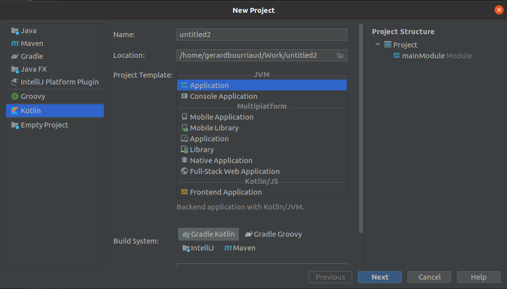
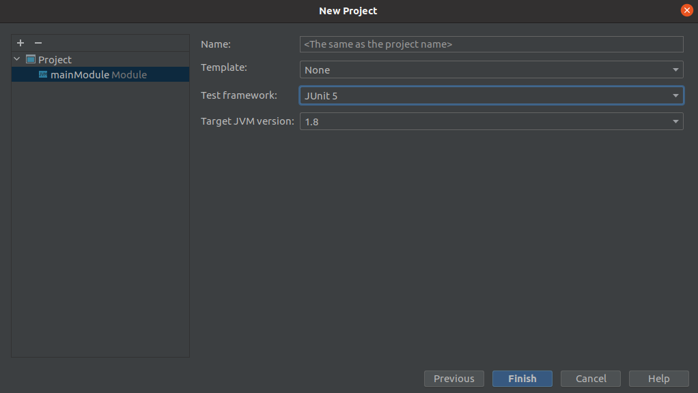

Create Kotlin light project in IntelliJ :

**File -> New project ..**

Select Kotlin & Application & Gradle KTS



Choose a project name, then **Next**

Choose JUnit5



In **settings.gradle.kts**

```kotlin
pluginManagement {
    this.repositories {
        this.gradlePluginPortal()
        this.jcenter()
        this.mavenLocal()
        this.mavenCentral()
    }
}
```

In **build.gradle.kts** by example 

```kotlin
import org.jetbrains.kotlin.gradle.tasks.KotlinCompile

plugins {
    this.kotlin("jvm") version "1.5.30"
    this.apply { this.id("fr.jhelp.compiler") version "1.2.10" }
    this.`maven-publish`
}

group = "fr.jhelp.example"
version = "1.1.0"

repositories {
    this.mavenCentral()
    this.mavenLocal()
}

dependencies {
    this.api("fr.jhelp.kotlwift:kotlwift:1.0.7")
    this.testImplementation(this.platform("org.junit:junit-bom:5.7.0"))
    this.testImplementation("org.junit.jupiter:junit-jupiter")
}

tasks.test {
    this.useJUnitPlatform()
    this.testLogging {
        this.events("passed", "skipped", "failed")
    }
}

tasks.withType<KotlinCompile>() {
    this.kotlinOptions.jvmTarget = "1.8"
}
```

` this.apply { this.id("fr.jhelp.compiler") version "1.2.10" }` => Apply transpiler plugin

`this.api("fr.jhelp.kotlwift:kotlwift:1.0.7")` => For Kotlin light tools

```kotlin
    this.testImplementation(this.platform("org.junit:junit-bom:5.7.0"))
    this.testImplementation("org.junit.jupiter:junit-jupiter")
}

tasks.test {
    this.useJUnitPlatform()
    this.testLogging {
        this.events("passed", "skipped", "failed")
    }
}
```
Necessary for unit tests

For the plugin able to work, need to specify a swift compilation tooL.

To get one : [https://swift.org/download/#releases](https://swift.org/download/#releases)

Need to add a local file (git ignore it, since it is dependants to your configuration) named `swiftCommand` at root project

It contains command necessary for launch the swift tools.
Depends on installation, it can be as simple as

```
swift $1 $2 $3 $4 $5 $6 $7 $8 $9
```

Have to add arguments for command

for docker, it exists the command line
```shell script
docker run [OPTIONS] IMAGE [COMMAND] [ARG...]
```

so something like
```
docker run [OPTIONS] IMAGE swift
```

should work, see [https://docs.docker.com/engine/reference/commandline/run/](https://docs.docker.com/engine/reference/commandline/run/)

 